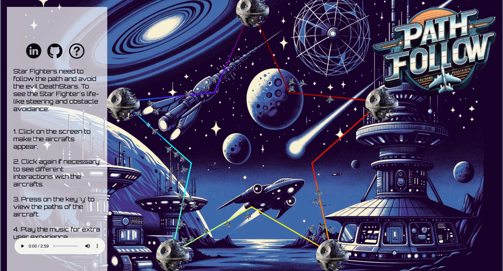
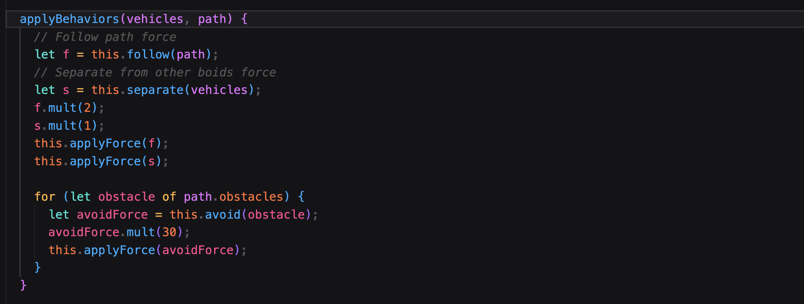
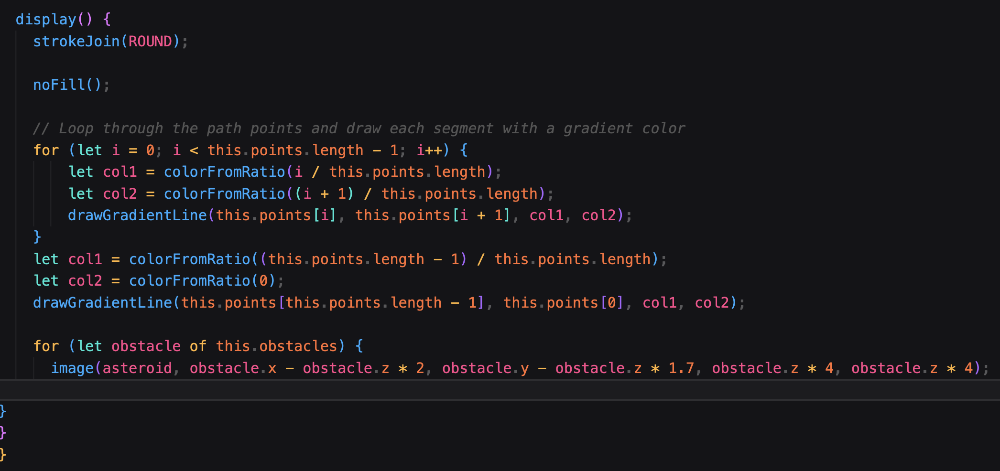

# Path Following Simulation

[PathFollowSimulation](https://allonnam96.github.io/PathFollowSimulation/) offers an immersive, space-themed visual journey where vehicles gracefully navigate a cosmic pathway. This simulation is crafted using the P5 library, drawing inspiration from Craig Reynolds' theory on Steering Behaviors for Autonomous Characters. Key features like the p5.Vector class are adeptly employed, bringing programmed movements to life.

## How to Engage:

1. Interact directly with the simulation by clicking on the canvas, allowing you to strategically place vehicles at points of your choosing. 
2. For an enhanced view of the moving vehicles' trajectories, press any case of 'Y'.

## Core Features:

### Vehicles

These dynamic entities are programmed to intuitively follow a designated path. They exhibit sophisticated behaviors like collision avoidance, ensuring smooth navigation amidst fellow vehicles and potential obstacles.

### Path

The path is a masterful blend of art and technology, depicted as a series of points that transition through a gradient of mesmerizing colors. This visual representation not only serves as a track for the vehicles but also adds an aesthetic appeal to the overall experience.

## Future Improvements:

* Implementing a mechanism to prevent vehicle generation upon clicking the icons.
* Introducing a feature where vehicles decelerate when approaching obstacles.